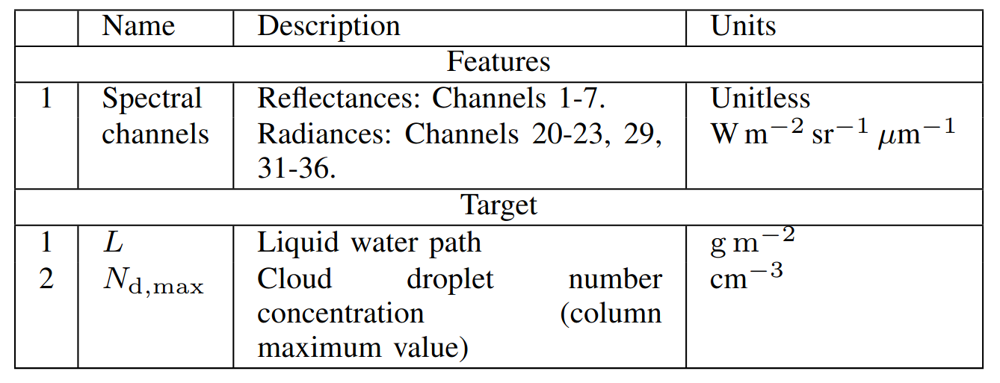
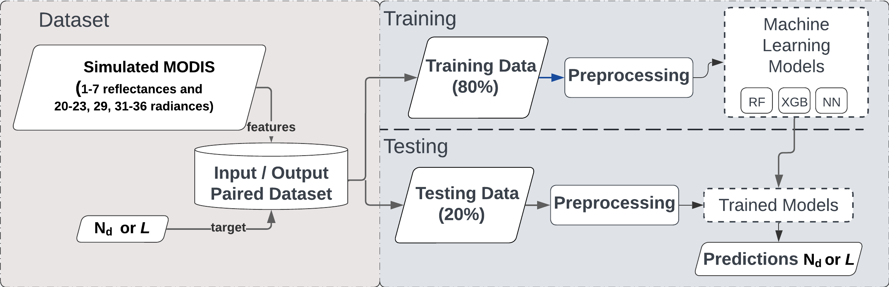
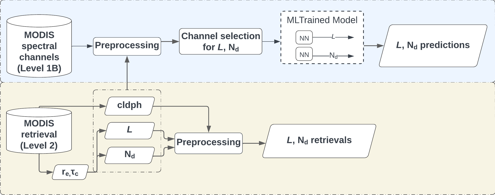
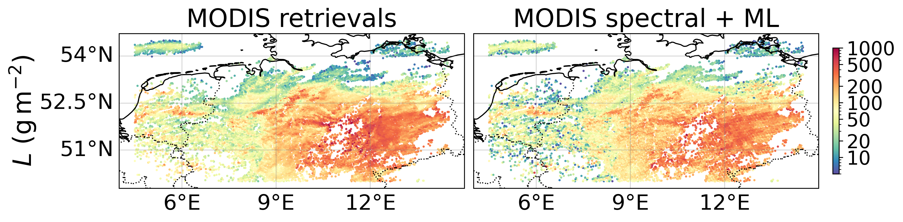
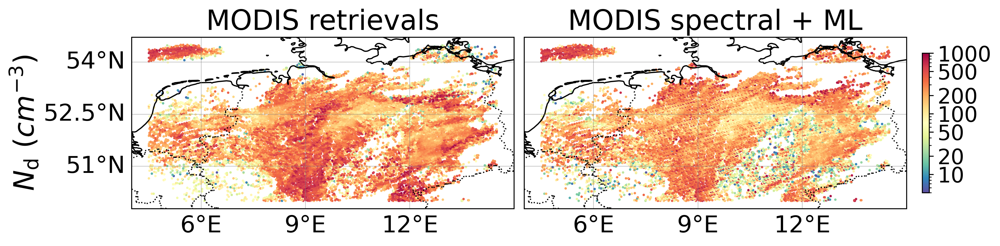
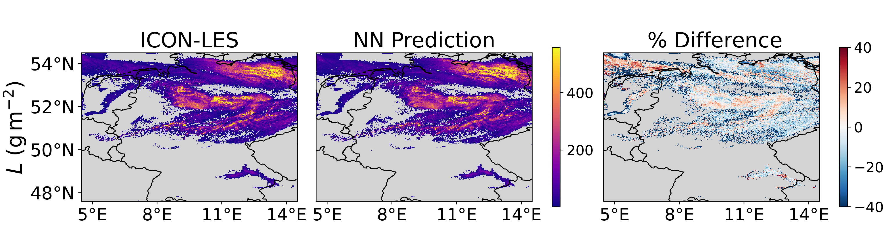
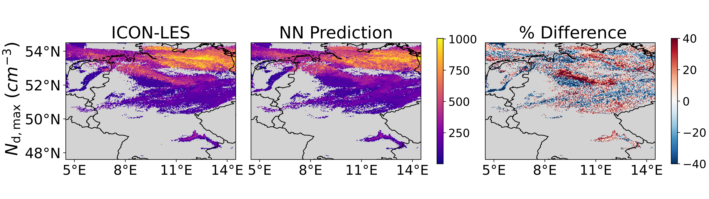

# Project Overview
In this study, we present a machine learning (ML) framework that directly predicts Nd and L from satellite spectral reflectance and radiance data,  thereby circumventing conventional assumptions in retrieval algorithms.
- This is the code that was used for the development of the paper: DOI: 10.1109/JSTARS.2025.3601981

    
The folder "training_ml_models"  implements both standard statistical methods and machine learning (ML) methods for data analysis and prediction. The pipeline is divided into two main sections.

The folder "modis_prediction"  implements the use of the ML model with MODIS level 1 and also we process MODIS level 2.

    training_ml_models
    modis_prediction

1. training_ml_models
 Overview of the thermodynamic variables used for the ML models based on ICON-LES data and simulated MODIS . 
 
<figure>
  <figcaption>Overview of the thermodynamic variables used for the ML models based on ICON-LES data and simulated MODIS. </figcaption>
  
</figure>

<figure>
  <figcaption>Overview of diagram ML models based with inputs simulated MODIS and output ICON-LES data. </figcaption>
  
</figure>

1. modis_prediction
<figure>
  <figcaption>Overview of diagram using MODIS data with inputs MODIS and the trained ML (previous step).  </figcaption>
  
</figure>

 

 
<table>
  <tr>
    <td>
        <figure>
        <figcaption>Example prediction using simulated MODIS for L) </figcaption>
        
        </figure>
</td>
    <td>
        <figure>
        <figcaption>Example prediction using simulated MODIS for Nd) </figcaption>
        
         </figure>
    </td>
  </tr>
</table>

<table>
  <tr>
    <td>
        <figure>
        <figcaption>Example prediction using MODIS level 1 for L) </figcaption>
        
        </figure>
</td>
    <td>
        <figure>
        <figcaption>Example prediction using MODIS level 1 for Nd) </figcaption>

J. Gonzalez, S. Dipu, G. Jimenez, G. Camps-Valls and J. Quaas, "Machine Learning-Based Retrieval of Cloud Droplet Number Concentration and Liquid Water Path from Satellite Spectral Data," in IEEE Journal of Selected Topics in Applied Earth Observations and Remote Sensing, doi: 10.1109/JSTARS.2025.3601981. keywords: {Clouds;Satellites;Aerosols;Atmospheric modeling;Uncertainty;Ocean temperature;Machine learning;Remote sensing;MODIS;Earth;Cloud droplet number concentration;Liquid water path;MODIS;Satellite data;Retrieval errors}, 
            
        
         </figure>
    </td>
  </tr>
</table>
